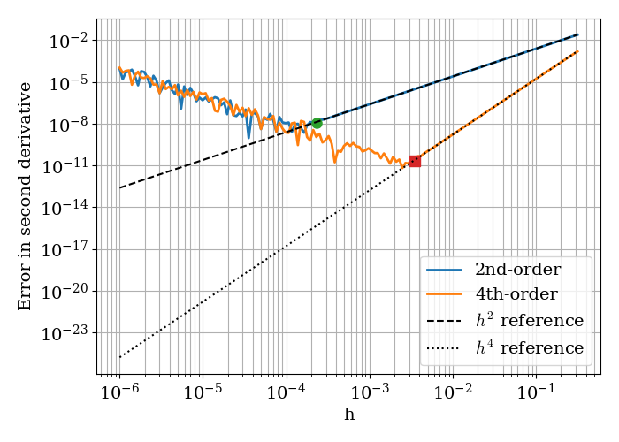
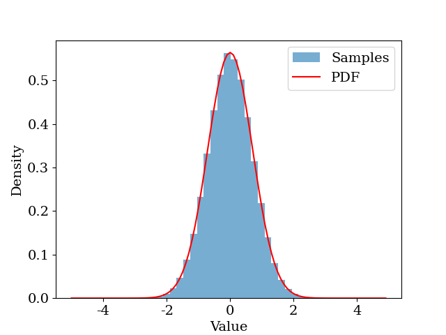
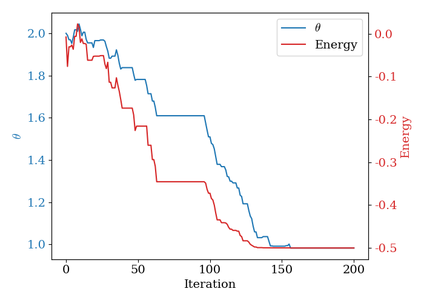
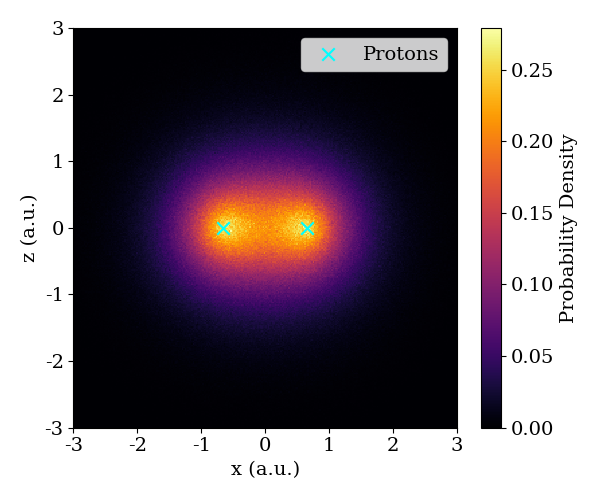

# Variational Monte Carlo of the Hydrogen Molecule

[日本語](#日本語)

This project uses a computational method called **Variational Monte Carlo (VMC)**
to predict two things about the hydrogen molecule (H₂):

1. How far apart its two atoms naturally sit (the **bond length**)
2. How much energy is released when the bond forms (the **binding energy**)

---

## Overview

The problem: the configuration of molecules more complex than a single
hydrogen atom cannot be calculated directly, and therefore has to be solved
using computational methods. A molecule naturally settles into whatever
configuration has the least energy、therefore this project aims to find the
configuration of the hydrogen molecule with the least energy, using the
following computational methods:

**Monte Carlo integration** is used to estimate the molecule's energy for a
given trial wavefunction. The energy is defined mathematically as an integral
over all possible positions of every electron, but this integral has no
closed-form solution once more than one electron is involved. Monte Carlo integration gets
around this by approximating the integral as an average. Instead of
integrating over every possible position, it samples a large number of
positions, calculates the energy at each one, and averages the results. The
more samples used, the more accurate the estimate.

**The Metropolis algorithm** is the method used to generate those samples
correctly. The samples can't just be picked uniformly at random, they need
to be distributed according to the probability density of the wavefunction,
|ψ|², so that positions where the electron is more likely to be found are
sampled more often. The Metropolis algorithm achieves this by proposing a
small random step from the current position, then accepting or rejecting it
based on the ratio of probability densities at the new and old positions. A
move to a more probable position is always accepted, while a move to a less
probable position is accepted only with a probability equal to that ratio.
Repeating this many times produces a sequence of sample positions whose
overall distribution converges to |ψ|², which is exactly the distribution
needed for the Monte Carlo estimate above to be valid.

**Simulated annealing** is used to optimise the parameters of the trial
wavefunction itself. The trial wavefunction's exact shape depends on one or
more unknown parameters, and the values of these parameters that minimise
the energy are not known in advance, they must be found by search.
Simulated annealing performs this search by proposing a random change to a
parameter, accepting it immediately if it lowers the energy, and accepting
it with a probability that decreases over time if it raises the energy. This
controlled chance of accepting a worse move allows the search to escape
local minima, rather than converging prematurely on the first reasonable value it finds. As the search
progresses, that acceptance probability is steadily reduced (referred to as
"cooling"), so the search becomes increasingly selective and settles on a
final set of parameter values.

Together, these three methods form a loop: a candidate set of wavefunction
parameters is proposed by simulated annealing, the Metropolis algorithm
generates electron position samples consistent with that wavefunction, and
Monte Carlo integration turns those samples into an energy estimate, which
is fed back to simulated annealing to decide whether to accept the proposed
parameters. The final, lowest-energy result of this loop is the project's
prediction for the configuration of the hydrogen molecule.

---

## File 1: `finite_difference_test.py` — validating the numerical derivative

The energy calculations depend on computing a second
derivative of the wavefunction at sampled points. Computers can't perform
exact calculus on an arbitrary function, so this is approximated instead,
using a method called the 2nd-order central-difference formula. This file
checks that approximation is accurate.

The test uses the ground-state wavefunction of the harmonic oscillator, a
standard system whose exact second derivative is known analytically. The
numerical approximation is compared against this exact value across a wide
range of step sizes, to find where the approximation is reliable. It also
compares the 4th-order central-difference formula for reference.

**Results:**

For larger step sizes, the error decreases as the step size shrinks, exactly
as predicted by the formula's theoretical accuracy. Below a certain step
size, however, the error starts increasing again. This happens because the
calculation involves subtracting nearly-equal numbers, and a computer can
only store numbers to a fixed number of significant digits. Once the step
size is small enough, that subtraction is dominated by floating-point
rounding error rather than the true difference being measured. This file
identifies the step size that minimises total error, and that step size is used in every later file.

---

## File 2: `metropolis_1d_test.py` — validating the Metropolis sampler in 1D

This file tests the Metropolis algorithm described above, on the simplest
possible system: a single particle in one dimension, under the harmonic
oscillator potential. The exact ground-state and first-excited-state
energies for this system are known from theory, so this is a controlled
test of whether the sampling method itself is implemented correctly, before
extending it to the much harder 3D and 6D cases that follow.

The algorithm generates a large number of sample positions, and the
resulting distribution is compared against the known analytical probability
density. The same samples are then used to compute a Monte Carlo estimate
of the energy, via the local energy formula, for both the ground state and
the first excited state.

**Results:**

*The histogram of sampled positions (blue) matches the exact probability
density (red), confirming the Metropolis algorithm is sampling correctly.*

---

## File 3: `vmc_hydrogen_atom_3d.py` — the hydrogen atom in 3D, with an unknown parameter

This file extends the method to a single hydrogen atom (one proton, one
electron) in full three-dimensional space. The exact ground-state energy
for this system is also known, so it still serves as a validation case.

The trial wavefunction used here, ψ(r; θ) = e^(−θr), depends on a
variational parameter, θ, whose correct value isn't known in advance.
Simulated annealing is used to search over θ: at each step, a new θ is
proposed and its energy is estimated, the move is accepted if the energy
decreases, and accepted anyway with a probability that depends on how much
worse it is, and that gradually decreases over the course of the search.

**Results:**

*θ (blue) and energy (red) both converge as the simulated annealing search
progresses, settling near the known exact values of θ = 1 and E = −0.5.*

---

## File 4: `vmc_hydrogen_molecule.py` — the hydrogen molecule

This file applies the full method to the actual system of interest: the
hydrogen molecule, H₂ (two protons and two electrons). The underlying equation used here has no
closed-form answer once electron-electron interaction is included.

The trial wavefunction form is known as the **Slater-Jastrow** form. This
wavefunction depends on three variational parameters (θ₁, θ₂, θ₃), rather
than the single parameter used for the hydrogen atom.

**Results:**

*Each electron's sampled positions are plotted as a 2D probability density.
The concentration of density between the two protons (marked X) is
consistent with a bonding molecular orbital.*

---

## Tools used

Python, NumPy (numerical arrays and vectorised computation), Matplotlib
(plotting), SciPy (curve fitting for the Morse potential).

---
## Report

The full write-up (method, results, error analysis) is in [`report.pdf`](VMC_Report.pdf).

---

# 日本語

[English](#variational-monte-carlo-of-the-hydrogen-molecule)

# 水素分子の変分モンテカルロ法

本プロジェクトでは、**変分モンテカルロ法（VMC）**を用いて水素分子（H₂）の以下の2つの物理量を予測する。

1. 2つの原子間の平衡距離（**結合長**）
2. その配置における最小エネルギー（**結合エネルギー**）

---

## 概要

水素原子より複雑な分子の配置は解析的に求めることができず、数値計算による手法が必要となる。分子は最もエネルギーの低い配置に自然と落ち着く性質があるため、本プロジェクトではその最小エネルギー配置を以下の計算手法を組み合わせて求める:

**モンテカルロ積分**は、与えられた試行波動関数に対するエネルギー期待値の推定に用いる。エネルギーは全電子の位置にわたる積分ですが、電子が複数になると解析的に解けません。モンテカルロ積分はこの問題を、積分を大量のサンプルの平均として近似することで回避する。サンプル数が増えるほど推定精度が向上する。

**メトロポリス法**は、上記のサンプルを正しく生成するためのアルゴリズムである。サンプルは一様にランダムに生成するのではなく、波動関数の確率密度|ψ|²に従って分布させる必要がある。メトロポリス法では、現在の位置から小さなランダムステップを提案し、新旧の確率密度の比に基づいて採否を決定する。より確率の高い位置への移動は必ず採用し、より低い位置への移動は確率密度の比に等しい確率で採用する。この操作を多数回繰り返すことで、サンプルの分布が|ψ|²に近づいていく。

**Simulated annealing**は、試行波動関数のパラメータを最適化に用いる。試行波動関数はパラメータに依存しており、エネルギーを最小化するパラメータの値はあらかじめ分からないため、探して求める必要がある。Simulated annealingでは、パラメータにランダムな変化を提案し、エネルギーが下がれば即座に採用し、上がる場合でも時間とともに減少する確率で採用する。この「悪化を許容する確率」により、局所最小値にはまり込むのを防げる。時間が進むにつれてこの受理確率を少しずつ低下させ、最終的な解へと収束させる。

Simulated annealingが変分パラメータの候補を提案し、メトロポリス法がその波動関数に従う電子位置サンプルを生成し、モンテカルロ積分がサンプルからエネルギーを推定し、その結果をSimulated annealingにフィードバックしてパラメータの採否を決定する。このループで得られる最終的なエネルギーが、水素分子の最小エネルギーとなる。

## ファイル1：`finite_difference_test.py` — 数値微分の検証

エネルギー計算は、サンプル点での波動関数の2階微分の計算を必要とする。コンピュータは任意の関数に対して厳密な微積分を実行できないため、2次中心差分公式による近似を使用する。本ファイルでは、この近似を実際の計算に使用する前に精度を検証する。

テストには調和振動子の基底状態波動関数を使用する。この系は2階微分の厳密解が解析的に知られており、広範なステップ幅にわたって数値近似との比較が可能である。また参考として4次中心差分公式との比較も行う。

**結果：**

大きなステップ幅では、ステップ幅を縮小するにつれて誤差が理論予測通りに減少する。しかし一定以下のステップ幅では誤差が増加に転じる。これは、ほぼ等しい数値の差分演算において浮動小数点の桁落ちが支配的になるためである。本ファイルはこれら2つの誤差がつり合う最適なステップ幅を特定し、以降のすべてのファイルで使用する。

---

## ファイル2：`metropolis_1d_test.py` — 1次元でのメトロポリス法の検証

本ファイルでは、最も単純な系である1次元調和振動子ポテンシャル下の1粒子にメトロポリス法を適用し、アルゴリズムの正確性を検証する。この系の基底状態および第1励起状態のエネルギーは理論的に既知であるため、より高次元の3次元・6次元への拡張前の制御されたテストとして機能する。

アルゴリズムにより大量のサンプル位置を生成し、その分布を既知の解析的確率密度と比較する。同じサンプルを用いて、局所エネルギー公式による基底状態および第1励起状態のモンテカルロエネルギー推定も行う。

**結果：**

*サンプル位置のヒストグラム（青）が確率密度（赤）と一致しており、メトロポリス法が正しくサンプリングできていることが確認できる。*

---

## ファイル3：`vmc_hydrogen_atom_3d.py` — 3次元水素原子と未知パラメータ

本ファイルでは、1陽子・1電子系の水素原子に手法を拡張し、完全な3次元空間で計算を行う。この系の基底状態エネルギーも既知であるため引き続き検証用として機能するが、以降のより難しい問題に共通する重要な特徴を導入する。

使用する試行波動関数ψ(r; θ) = e^(−θr)は、事前に正しい値が分からない変分パラメータθに依存する。シミュレーテッドアニーリングによりθを探索し、各ステップで新しいθを提案してエネルギーを推定し、エネルギーが減少すれば受理し、悪化する場合も探索の進行とともに減少する確率で受理する。これにより、局所最小値への収束を回避する。

**結果：**

*シミュレーテッドアニーリングの探索が進むにつれてθ（青）とエネルギー（赤）がともに収束し、既知の厳密値θ = 1、E = −0.5に近い値に落ち着く。*

---

## ファイル4：`vmc_hydrogen_molecule.py` — 水素分子

本ファイルでは、実際の対象系である水素分子H₂（2陽子・2電子）に完全な手法を適用する。電子間相互作用を含むため、対応する方程式には閉じた形の解が存在しない。

使用する試行波動関数は**スレーター-ジャストロー型**であり、水素原子で使用した1パラメータに対して3つの変分パラメータ（θ₁, θ₂, θ₃）を持つ。

**結果：**

*各電子のサンプル位置を2次元確率密度としてプロットする。2つの陽子（×印）の間に密度が集中しており、結合性分子軌道と整合する。*

---

## 使用ツール

Python、NumPy（数値配列・ベクトル化演算）、Matplotlib（グラフ描画）、SciPy（モースポテンシャルのカーブフィッティング）。

---

## レポート

詳細な手法・結果・誤差解析は [`report.pdf`](LabReport_AIP.pdf) をご覧ください。
